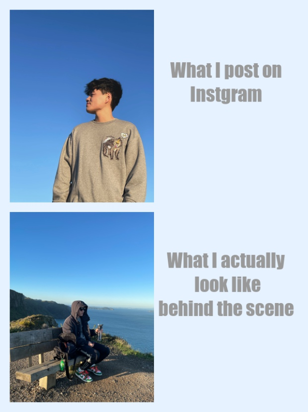

# Hello world!
## Welcome to my page!

### About me

I am currently styding part time at the University of Auckland and working full time for Air NZ.
I love travelling, taking photos, and food! I also do post my photos on Instagram a lot to share with my friends.
Everyday is different, but I start my day in a same wake up rountine:


1. Open my eyes
2. Check Instagram stories
3. Check Instagram posts
4. Check my Email
5. Get up

### What is this meme about?

My friends always laugh at how I behave differently in the photos compared with in noramly life. That's how i get the idea of making this meme: 
*What I look like in my Instagram photo* **VS** *whats behind the scene*.

### My meme



### R code I used to create this meme
---
title: "meme"
author: "Brent GUO"
date: "19/03/2022"
output: html_document
Highlight: espresso
---

```{r setup, include=FALSE}
knitr::opts_chunk$set(echo = TRUE)
library(magick)
```

```{r meme}
pic_1 <- image_read("pics/1.jpg")%>%
  image_background("#e6f2ff", "300x300")%>%
  image_scale(300)
pic_2 <- image_read("pics/2.png")%>%
  image_background("#e6f2ff", "300x300")%>%
  image_scale(300)
square1 <- image_blank(width = 300, height = 300, color = "#e6f2ff") %>%
                       image_annotate(text = "What I post on\nInstgram", 
                                      color = "#999999", 
                                      size = 40, 
                                      font = "Impact", 
                                      gravity = "center")
square2 <- image_blank(width = 300, height = 300, color = "#e6f2ff") %>%
                       image_annotate(text = "What I actually\n look like\nbehind the scene", 
                                      color = "#999999", 
                                      size = 40, 
                                      font = "Impact", 
                                      gravity = "center")

v1 <- c(pic_1, square1)
v2 <- c(pic_2, square2)
top <- image_append(v1)%>%image_border("#e6f2ff", "10x10")
btm <- image_append(v2)%>%image_border("#e6f2ff", "10x10")
v<- c(top,btm)
meme <- image_append(v,stack = TRUE)%>%
  image_scale(500)%>%
  image_border("#e6f2ff", "10x10")
image_write(meme, "my_meme.png")
```


